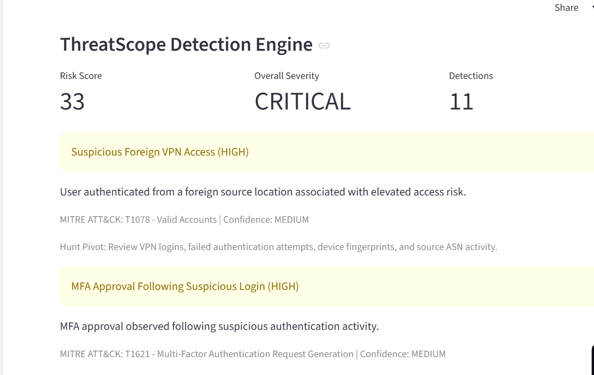
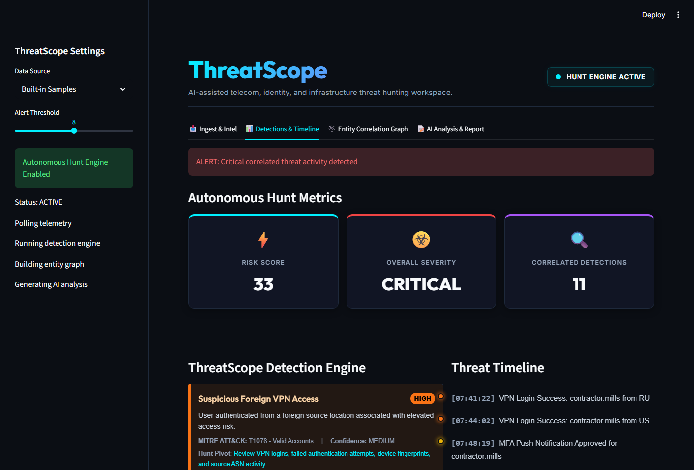
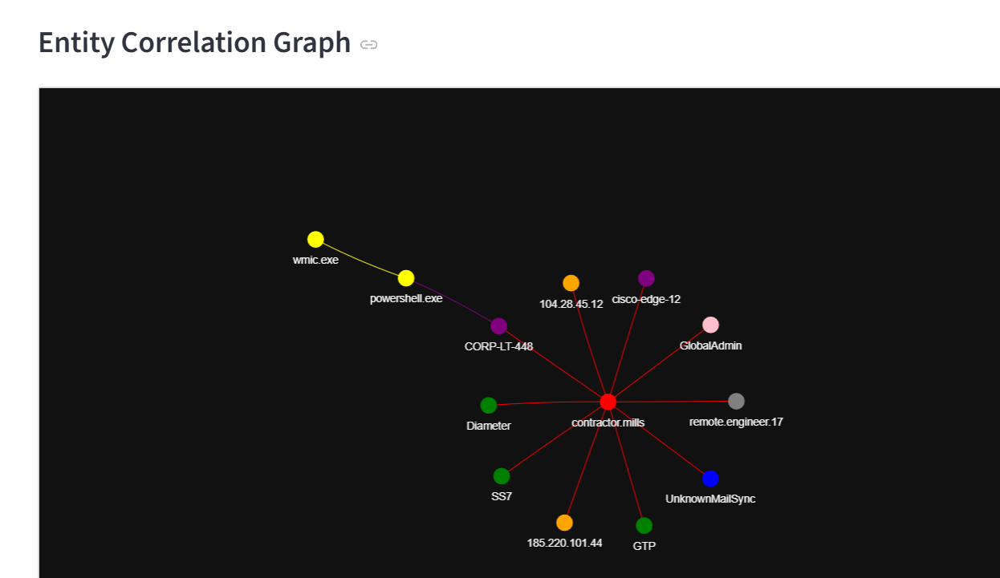
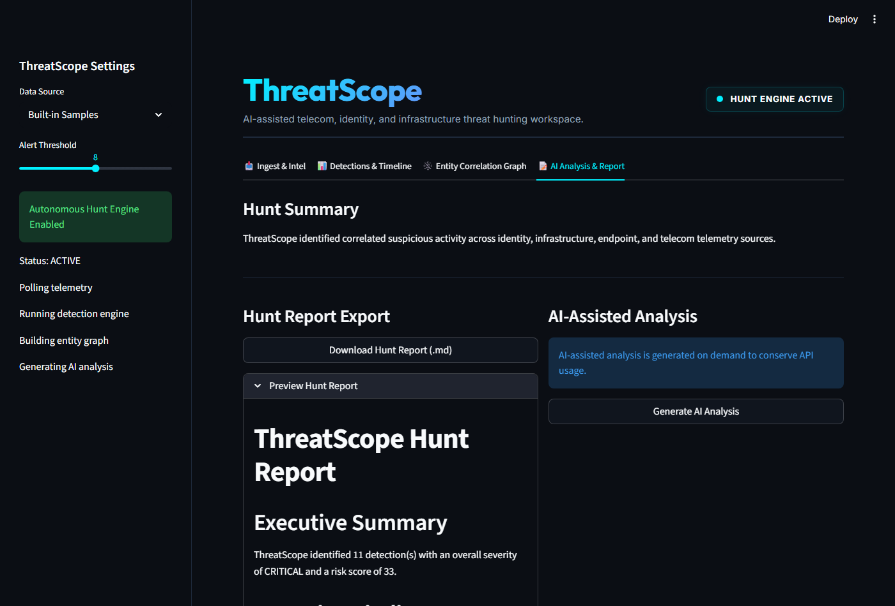
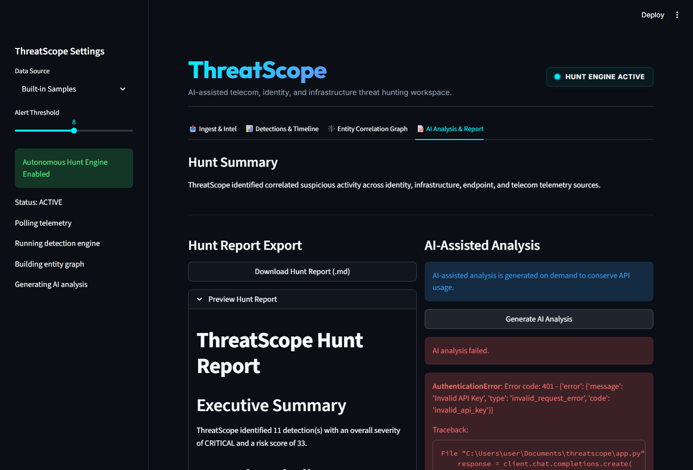

# ThreatScope

AI-assisted threat hunting platform for telecom, identity, endpoint, and cloud infrastructure investigations.

**Live Demo:** https://threatscope-ame8t7utwmtjl8rnyauohb.streamlit.app/

---

## Overview

ThreatScope is a defensive security project that simulates how a SOC or CTI team can investigate suspicious activity across multiple telemetry sources.

The app correlates simulated events into a hunt workflow with:

- Detection findings
- Risk scoring
- MITRE ATT&CK mapping
- Threat timeline reconstruction
- Entity correlation graph
- AI-assisted analyst summary
- Markdown hunt report export
- Optional local Elasticsearch ingestion

This project demonstrates detection engineering, threat hunting, and AI-assisted SOC workflows.

---

## Detection Engine



---

## Threat Timeline



---

## Entity Correlation Graph



---

## Hunt Report Generation



---

## AI-Assisted Hunt Analysis



## What ThreatScope Detects

ThreatScope currently models a correlated investigation involving:

- Suspicious VPN access
- MFA approval after suspicious login
- SSH remote management enablement
- PowerShell execution
- WMI lateral movement
- Privileged cloud role assignment
- OAuth consent abuse
- SS7 signaling anomalies
- Diameter roaming anomalies
- GTP roaming session anomalies
- Contractor verification risk

---
## Why ThreatScope Exists

Modern SOC teams investigate attacks across fragmented telemetry sources including identity, endpoint, telecom, VPN, SaaS, and cloud infrastructure logs.

ThreatScope was built to simulate how a threat hunter or detection engineer correlates these events into a coherent investigation workflow.

The goal is not to replace a SIEM or EDR platform, but to demonstrate:

- Detection engineering concepts
- MITRE ATT&CK mapping
- Threat correlation workflows
- Timeline reconstruction
- Entity relationship analysis
- AI-assisted analyst triage

   ---
  
## Core Workflow

```text
Telemetry Input
      ↓
Detection Engine
      ↓
Risk Scoring
      ↓
MITRE ATT&CK Mapping
      ↓
Threat Timeline
      ↓
Entity Correlation Graph
      ↓
AI-Assisted Hunt Analysis
      ↓
Markdown Hunt Report
```

---

## Architecture

```text
┌──────────────────────┐
│  Telemetry Sources   │
│ VPN / EDR / Identity │
│ Telecom / Cloud Logs │
└──────────┬───────────┘
           ↓
┌──────────────────────┐
│ Detection Engine     │
│ YAML Detection Rules │
└──────────┬───────────┘
           ↓
┌──────────────────────┐
│ Correlation Layer    │
│ Risk Scoring         │
│ MITRE Mapping        │
└──────────┬───────────┘
           ↓
┌──────────────────────┐
│ Threat Timeline      │
│ Entity Graph         │
│ AI Hunt Analysis     │
└──────────┬───────────┘
           ↓
┌──────────────────────┐
│ Hunt Report Export   │
└──────────────────────┘
```

---

### Detection Engine

ThreatScope uses a modular detection engine located in:

```text
engine/detections.py
```

The detection engine identifies suspicious activity and returns structured findings with:

- Title
- Severity
- Confidence
- MITRE ATT&CK mapping
- Description
- Hunt pivot

---
### YAML Detection Rules

ThreatScope supports external YAML-based detection rules for modular threat detection engineering.

Example rule structure:

```yaml
rules:

  - title: Suspicious Foreign VPN Access
    match:
      - vpn_login
      - country=RU
    severity: HIGH
    confidence: MEDIUM
    mitre: T1078 - Valid Accounts
---

### Threat Timeline

ThreatScope reconstructs suspicious activity into a chronological investigation timeline.

Example timeline events include:

```text
07:41 | Foreign VPN Login
07:48 | MFA Approval
07:56 | SSH Remote Management Enabled
08:02 | PowerShell Execution
08:04 | WMI Remote Execution
08:06 | Privileged Role Escalation
08:44 | OAuth Persistence Activity
```

---

### Entity Correlation Graph

ThreatScope builds an interactive graph showing relationships between:

- Users
- Source IPs
- Hosts
- Edge devices
- Processes
- OAuth apps
- Telecom signaling protocols
- Privileged roles

This helps visualize how separate events connect into one hunt case.

---

### MITRE ATT&CK Mapping

Current mapped techniques include:

- T1078 — Valid Accounts
- T1621 — Multi-Factor Authentication Request Generation
- T1059.001 — PowerShell
- T1047 — Windows Management Instrumentation
- T1098 — Account Manipulation
- T1550 — Use Alternate Authentication Material
- T1021 — Remote Services
- T1430 — Location Tracking

---

### Hunt Report Export

ThreatScope generates a downloadable Markdown hunt report containing:

- Executive summary
- Detection findings
- Severity and confidence
- MITRE ATT&CK mapping
- Timeline
- Recommended next steps

---

## Technology Stack

- Python
- Streamlit
- Groq API
- Llama 3.3
- NetworkX
- PyVis
- Elasticsearch
- Docker
- MITRE ATT&CK

---

## Project Structure

```text
threatscope/
│
├── app.py
├── requirements.txt
├── README.md
│
├── engine/
│   └── detections.py
│
├── reports/
│   └── sample_hunt_report.md
│
├── load_sample_logs.py
├── docker-compose.yml
└── .streamlit/
    └── secrets.toml
```

---

## Public Demo Notes

The public Streamlit demo uses the **Built-in Samples** data source.

The **Elastic SIEM Connector (Local Demo)** option is intended for local testing only. It requires Elasticsearch to be running on the same machine as the app.

On Streamlit Cloud, `localhost:9200` does not point to your local computer, so Elastic mode is expected to fail unless Elasticsearch is hosted externally.

---

## Run Locally

Clone the repository:

```bash
git clone https://github.com/briwandt/threatscope.git
cd threatscope
```

Install dependencies:

```bash
pip install -r requirements.txt
```

Create Streamlit secrets:

```bash
mkdir .streamlit
```

Create:

```text
.streamlit/secrets.toml
```

Add your Groq API key:

```toml
GROQ_API_KEY = "your_groq_api_key_here"
```

Run the app:

```bash
streamlit run app.py
```

---

## Optional Local Elastic SIEM Lab

ThreatScope includes an optional local Elasticsearch lab.

Start Elastic:

```bash
docker compose up -d
```

Load sample telemetry:

```bash
python load_sample_logs.py
```

Then open the app and select:

```text
Elastic SIEM Connector (Local Demo)
```

---

## Sample Hunt Case

The built-in sample simulates a correlated threat scenario:

```text
Suspicious contractor VPN login
      ↓
MFA approval
      ↓
SSH enabled on edge infrastructure
      ↓
PowerShell and WMI execution
      ↓
Privileged cloud role assignment
      ↓
OAuth consent persistence
      ↓
Telecom signaling anomalies
```

---

## Future Enhancements

- External JSON/YAML detection rules
- Sigma rule ingestion
- Real log parser support
- STIX/TAXII enrichment
- Elastic Cloud integration
- Directional graph edges
- Detection tuning workflow
- Authentication baseline modeling
- PDF report export

---

## Purpose

ThreatScope demonstrates practical skills in:

- Detection engineering
- Threat hunting
- SOC workflow design
- Telecom CTI analysis
- MITRE ATT&CK mapping
- Python security tooling
- AI-assisted analyst workflows

---
## Current Limitations

ThreatScope is a portfolio and educational project, not a production SIEM.

Current limitations include:

- Simulated telemetry datasets
- Limited parser support
- No persistent backend datastore
- No authentication or RBAC
- No multi-user support
- Simplified rule correlation logic
- Local-only Elastic connector support

---

## Disclaimer

ThreatScope is intended strictly for defensive security research, education, and portfolio demonstration.

No offensive functionality is included.

